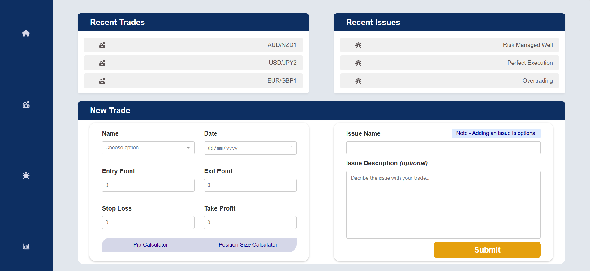

# Trading Journal 📓
The Trading Journal is a full-stack web application built with React for the frontend and Spring Boot for the backend. 
It allows users to document and track their trades by inputting key details such as entry/exit points, stop loss, take profit, and trade date. 
The backend processes and stores the trade data, enabling data persistence and future enhancements like analytics.

### Frontend:
- Log trades with details such as trade name, date, entry/exit points, stop loss, and take profit.
- View a list of trades added by the user.

### Backend:
- REST API to handle trade-related data operations.
- Persistent storage using a PostgreSQL database.
- Future support for analytics and data processing.

## Tech Stack
Frontend:
- React 

Backend:
- Spring Boot (Java)
- JPA/Hibernate for database interactions

## Pages
**Home Page:** 
> Allows users to add a new trade and associated issue by filling in the trade form.


**Trades Page:** 
> Displays a list of trades retrieved from the backend API. Can also filter trades by past week, past month, 3 months, 6 months and a full year.


**Issues Page:** 
> Tracks bugs or issues related to trades.

**Analytics Page:** 
> (In future) Will analyze trades and provide detailed performance statistics.


## Setup and Installation
**Frontend**

Clone the repository:
```
git clone https://github.com/Y-Negash/Trading_Journal.git
```

Navigate to the project directory:
```
cd Trading_Journal/frontend
```

Install frontend dependencies:
```
npm install
```

Start the React development server:
```
npm run dev
```

Open your browser and go to http://localhost:3000.

